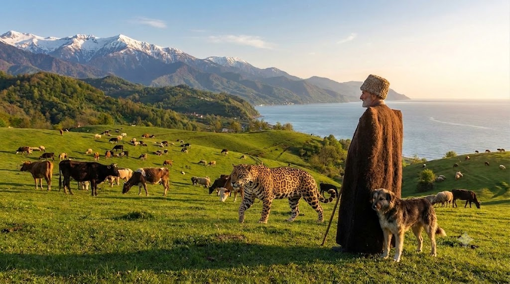
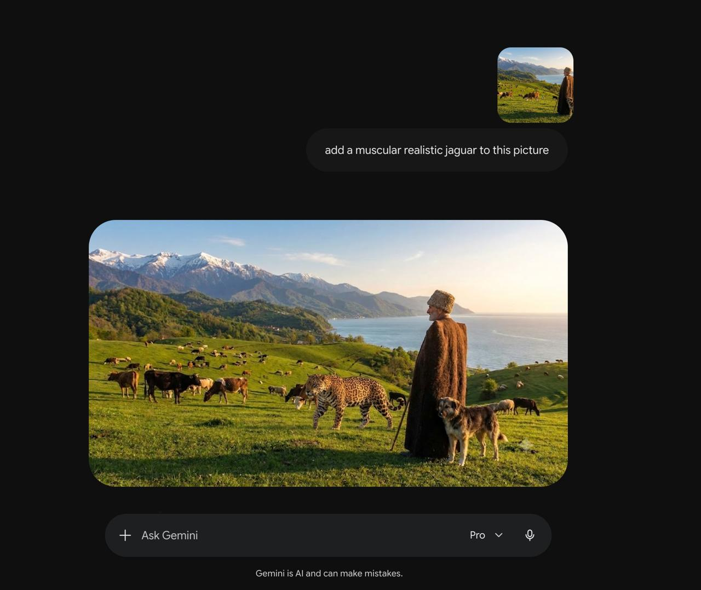
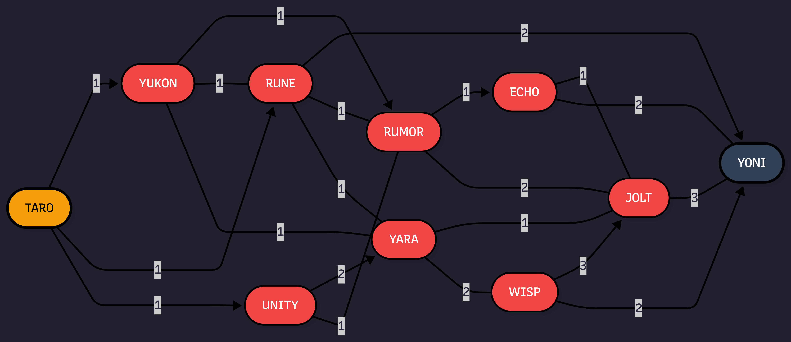

# Final Exam - Answers

**Student:** Kamil Nuriev  
**Ilia State University**  
**Course:** Introduction to Artificial Intelligence

---

## Task 1. Using generative AI

Using Google Gemini, a Jaguar was added to the original picture. Below is the resulting picture (the Jaguar has been inserted into the scene).

---

## Task 2. Creating user manual

Step-by-step manual for signing up to the AI tool used for Task 1 (Google Gemini) and adding the Jaguar to the picture.

### What you need before you start
- A computer, tablet, or phone with an internet connection.
- A modern web browser (Google Chrome, Firefox, Edge, or Safari).
- The original photograph you want to edit. For this task we start from the picture below (a forest scene **without** a Jaguar):

---

### Step 1 — Create a Google account
Google Gemini uses a Google account, so you need one first.
1. Open <https://accounts.google.com/signup>.
2. Click **Create account** → choose **For my personal use**.
3. Enter your **First name** and **Last name**, then click **Next**.
4. Enter your **date of birth** and **gender**, then click **Next**.
5. Choose a Gmail address (pick a suggestion or create your own), then click **Next**.
6. Create a strong **password** and confirm it, then click **Next**.
7. (Optional) Add a recovery phone number and email — this helps recover the account later. Click **Next**.
8. Agree to the **Privacy and Terms** by clicking **I agree**.

> **Already have a Google account?** Skip to Step 2.

---

### Step 2 — Open Google Gemini and sign in
1. Open <https://gemini.google.com> in your browser.
2. Click **Sign in** (top-right corner) and enter the Google account from Step 1.
3. If prompted, review the **Welcome to Gemini** terms and click **I agree** / **Get started**.

The Gemini workspace has three main areas:
- **Left sidebar** — chat history and the **New chat** button.
- **Center** — the conversation area where prompts and answers appear.
- **Bottom** — the input box where you type your request, plus buttons to **upload images** and **send**.

---

### Step 3 — Upload the original picture
1. Click **New chat** (top-left) to start a fresh conversation.
2. In the bottom input bar, click the **image upload button** (the **"+"** / image icon next to the text field).
3. Select **Upload from computer**, choose the original picture file (`original_picture_no_jaguar.jpeg`) and click **Open**.
4. Wait until the image thumbnail appears inside the input box — the upload is then complete.

---

### Step 4 — Write the prompt to add the Jaguar
In the same input box (right next to the uploaded image), type a clear, descriptive instruction, for example:

> **Add a realistic jaguar standing naturally in the forest, matching the lighting and shadows of the scene. Make it look like it belongs in the photo.**

Tips for a good result:
- Be **specific** about the animal and where it should appear.
- Ask for **realistic lighting and shadows** so the result blends in.
- Mention the **style** (photorealistic) if the source is a photo.

Then press the **Send** button (or hit **Enter**).

---

### Step 5 — Generate and review the result
Gemini processes the request and displays the **edited image** in the conversation, right under your prompt. The screenshot below shows the Gemini interface with the Jaguar already generated from the prompt:

Review the result carefully:
- Is the Jaguar positioned naturally?
- Do the lighting and shadows match the original photo?
- Does the Jaguar look realistic?

If the result is not satisfactory, click **Modify** / **Regenerate**, or type a follow-up such as *"Make the jaguar smaller and place it on the left"* and Gemini will create a new version. Repeat until you are happy with the image.

---

### Step 6 — Download the final image
1. Hover over the generated image.
2. Click the **Download** icon (a down-arrow ⬇ in the image's top-right corner), or right-click the image and choose **Save image as…**.
3. Save the file with a clear name, e.g. `added_jaguar.jpeg`, and click **Save**.

---

### Result
The final picture, with the Jaguar added by Gemini:

As shown, Gemini successfully inserted a realistic Jaguar into the forest scene while preserving the original lighting and composition.

---

### Summary
1. Create / sign in to a **Google account**.
2. Open **gemini.google.com** and **sign in**.
3. Start a **new chat** and **upload** the original picture.
4. **Type a clear prompt** describing the Jaguar you want to add.
5. **Generate**, review, and refine the result.
6. **Download** the final image.

---

## Task 3. Finding the graph

I explored the chat bot at `https://max.ge/ai2026/final/graph_bot_Kamil_Nuriev_827305164.html` and drew the entire graph (every reachable node and transition is included).

